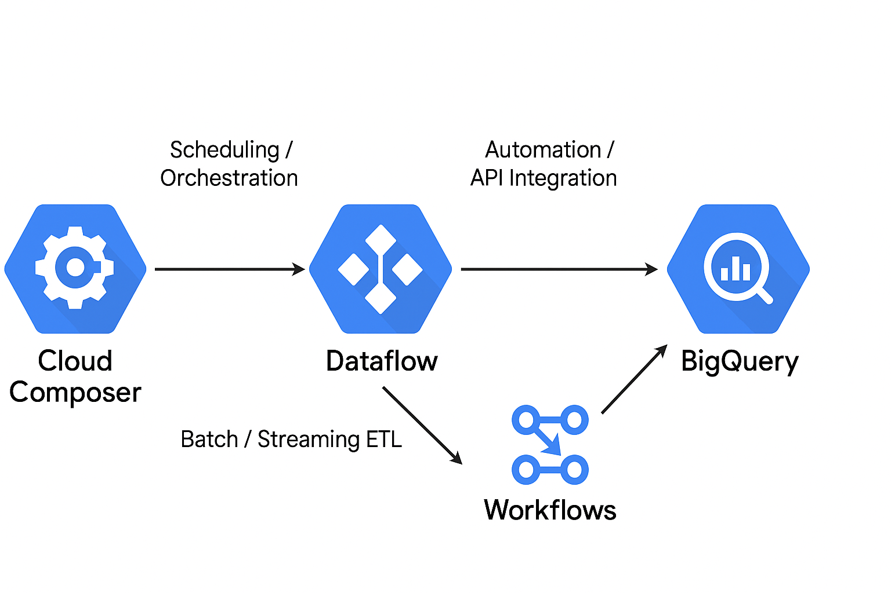
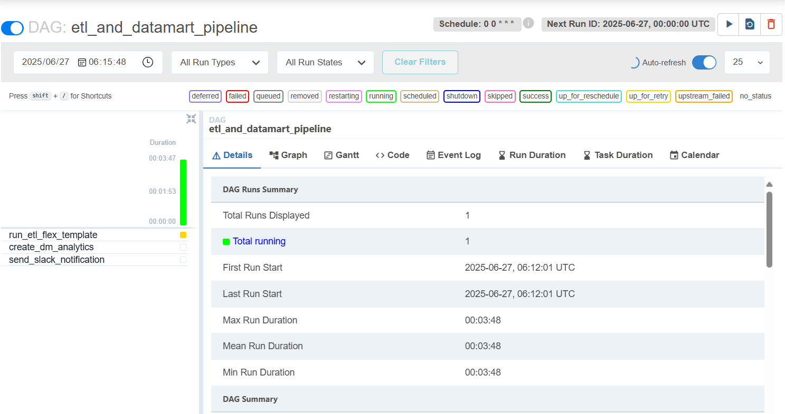
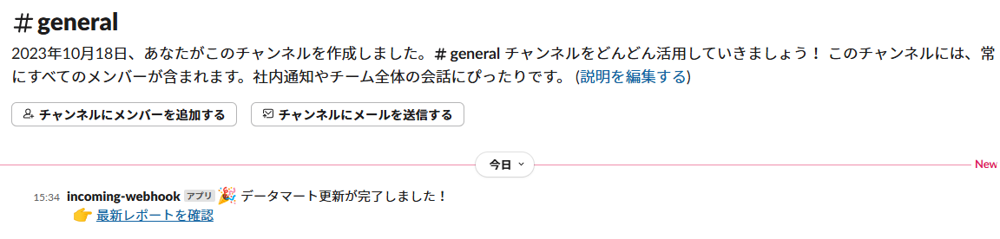
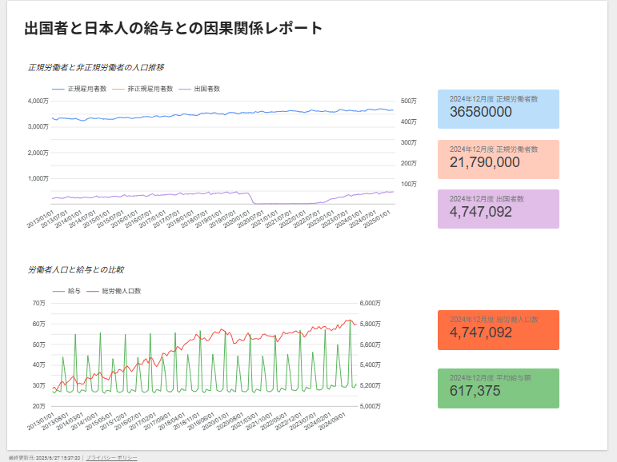

# 📊 データ分析プロジェクト：労働・給与と出国者数の傾向分析

## 📌 概要

本プロジェクトは、Google Cloud 上における**自動化されたデータ分析パイプライン**の構築を目的としています。  
Cloud Storage 上の CSV ファイルを起点に、Cloud Composer によるスケジュール制御、Dataflow による ETL 処理、  
BigQuery によるデータマート生成、Workflows による Slack 通知を連携させたフローを構成しています。

> データ分析の一連の流れを GCP 上で完結できる構成を学習・再現できるようにすることを目的としています。

## 🔍 分析目的

労働者人口（正規・非正規）と現金給与、出国者数の関係性を可視化・分析し、社会動向を把握することを目的とします。

## 📥 使用データ（政府統計の総合窓口 e-Stat より取得）

以下の統計データを活用します：

- **出国者数（総数）**  
  https://dashboard.e-stat.go.jp/timeSeriesResult?indicatorCode=0204040001000010010

- **正規の職員・従業員（男女計）**  
  https://dashboard.e-stat.go.jp/timeSeriesResult?indicatorCode=0303010000000010010

- **非正規の職員・従業員（男女計）**  
  https://dashboard.e-stat.go.jp/timeSeriesResult?indicatorCode=0303020000000010010

- **現金給与総額**  
  https://dashboard.e-stat.go.jp/timeSeriesResult?indicatorCode=0302020000000010000

---

## 🎯 この構成で実現できること

- GCP 上でデータ分析基盤（ETL〜集計〜通知）を構築
- Composer や Dataflow などのマネージドサービス連携を体得
- BigQuery 上に自動的に構築されたデータマートをもとに、Slack 通知などの運用連携が可能

---

## 🗺 アーキテクチャ図

---

## ✅ 処理の流れ

1. Cloud Storage に CSV ファイルが格納されている状態を前提とします
2. Cloud Composer の DAG により毎朝 9:00 にパイプラインが起動
3. Dataflow が起動し、Cloud Storage 上の CSV を加工して BigQuery に格納
4. BigQuery 上でマート用のクエリが自動実行され、集計テーブルが作成される
5. Workflows により、レポート生成完了後に Slack 通知が送信され、必要に応じて DL リンクも共有される

---

## 🖥 使用環境

| 項目             | 内容                                 |
| ---------------- | ------------------------------------ |
| OS               | Ubuntu（WSL2）5.15.167.4             |
| Terraform        | v1.12.1（任意）                      |
| Google Cloud SDK | 522.0.0                              |
| bq CLI           | 2.1.16                               |
| Python           | 3.10 以上（DAG/Dataflow スクリプト） |

---

## 📁 フェーズ構成（説明順）

| フェーズ | 説明                                                    |
| -------- | ------------------------------------------------------- |
| Phase 1  | Cloud Storage・BigQuery・Composer・Slack Webhook の準備 |
| Phase 2  | Cloud Composer による定期スケジューリング設定           |
| Phase 3  | Dataflow による CSV の ETL 処理 → BigQuery 書き込み     |
| Phase 4  | BigQuery 上でのマート生成クエリ実行                     |
| Phase 5  | Workflows による Slack 通知とレポート DL リンクの送信   |

---

## 📌 成果物の例

- Slack 通知のスクリーンショット（Workflows 経由）
- BigQuery 上に生成されたマートテーブル
- Composer DAG UI 上でのジョブ可視化
- （任意）Cloud Storage へ出力されたレポート CSV ファイル

---

## 🛠 使用技術スタック

- **Cloud Composer**（Airflow ベースのスケジューラ）
- **Dataflow**（Apache Beam ベースの ETL 処理基盤）
- **BigQuery**（DWH & SQL 分析）
- **Workflows**（マネージドワークフロー管理）
- **Slack Webhook**（通知連携）
- **Looker Studio**（ダッシュボードの可視化）

---

## 💼 実務応用ポイント

- 複数データソースからの統合およびスキーマ変換を Apache Beam により自動化
- DAG の分割・依存関係定義により、段階的に処理・通知が可能な構成に設計
- Slack 通知と Looker Studio ダッシュボード連携により、非エンジニア層への共有も想定
- Terraform により GCP リソース全体をコードで管理、再現性のあるインフラ構築を実現

---

## 🧭 想定ユースケース

- 定期的な政府統計データの収集・集計・共有
- 社内向けマーケティングレポートや月次報告用の自動化基盤構築
- データパイプライン全体の統合管理と通知による業務効率化

---

## 📁 ディレクトリ構成

<pre><code>
.
├── README.md
├── envs
│   └── dev
│       ├── backend.tf
│       ├── locals.tf (gitigore)
│       ├── main.tf
│       ├── outputs.tf
│       └── provider.tf
├── data
│   ├── nonregularemployee.zip
│   ├── passengers.zip
│   ├── regularemployee.zip
│   └── salary.zip
├── img
│   └── arch.png
├── modules
│   ├── artifactregistry
│   │   ├── outputs.tf
│   │   ├── registry.tf
│   │   └── variables.tf
│   ├── bq
│   │   ├── dataset.tf
│   │   ├── outputs.tf
│   │   └── variables.tf
│   ├── composer
│   │   ├── etl.tf
│   │   ├── outputs.tf
│   │   └── variables.tf
│   └── storage
│       ├── outputs.tf
│       ├── storage.tf
│       └── variables.tf
└── src
    ├── composer
    │   └── etl_dataflow_pipeline.py
    └── dataflow
        ├── Dockerfile
        ├── etl.py
        ├── metadata.json
        └── requirements.txt
</code></pre>

---

## 🚀 環境構築と実行手順

### 前提

- GCP プロジェクトが作成済であること
- Cloud Composer, Dataflow API などが有効化されていること

### 手順概要

# ① Terraform によるリソース構築

<pre><code>
cd modeules/envs/dev
terraform init
terraform apply
</code></pre>

# ② Artifical Registry への Image アップロード

<pre><code>
gcloud auth configure-docker asia-northeast1-docker.pkg.dev
docker build -t asia-northeast1-docker.pkg.dev/[プロジェクト ID]/dev-karasuit-create-template/etl-image:v1 .
docker push asia-northeast1-docker.pkg.dev/[プロジェクト ID]/dev-karasuit-create-template/etl-image:v1
</code></pre>

# ③ Dataflow 用の Template をビルド

<pre><code>
gcloud dataflow flex-template build gs://dev-karasuit-dataflow/templates/etl_template.json \
 --image "asia-northeast1-docker.pkg.dev/[プロジェクト ID]/dev-karasuit-create-template/etl-image:v1" \
 --sdk-language "PYTHON" \
 --metadata-file "metadata.json"
</code></pre>

# ④ DAG ファイルアップロード

<pre><code>
gsutil cp etl_and_datamart_pipeline.py gs://<composer-bucket>/dags/
</code></pre>

# ⑤ AirFlow から DAG を手動実行(本来であれば AM09:00 に自動起動)

# ⑥ Slack よりレポートの URL を連携

## ⚠️ 注意事項

- `dev/locals.tf` 等に記載されるプロジェクト ID などの機密情報は `.gitignore` に追加してください
- ServiceAccount の key ファイルは公開せず、Secret Manager 等で管理してください
- Slack Webhook の URL は外部に漏れないように環境変数または Secret Manager 経由で参照してください
- Looker Studio の テンプレートは予め作成しておいてください

---

## 📌 備考

この構成は、マーケティングやデータ分析基盤構築の実務において頻出の構成です。  
業務自動化・レポーティング・通知までを含む一連のパイプラインの理解・実践に役立ちます。

---
